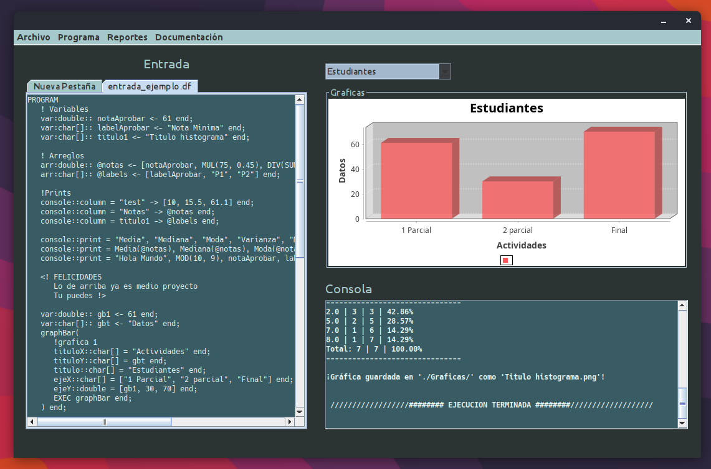

# Organizacion de Lenguajes y Compiladores 1 --> Proyecto 1

| Carnet | 202100119|
| ------ | ------ |
| Estudiante |Samuel Isaí Muñoz Pererira|
| Auxiliar | Walter Alexander Guerra Duque|

 

Programa Base

 

Reportes

